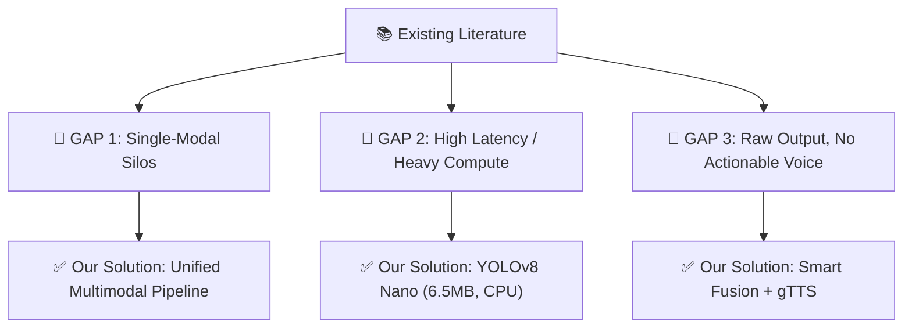
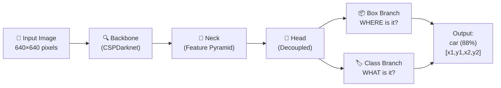
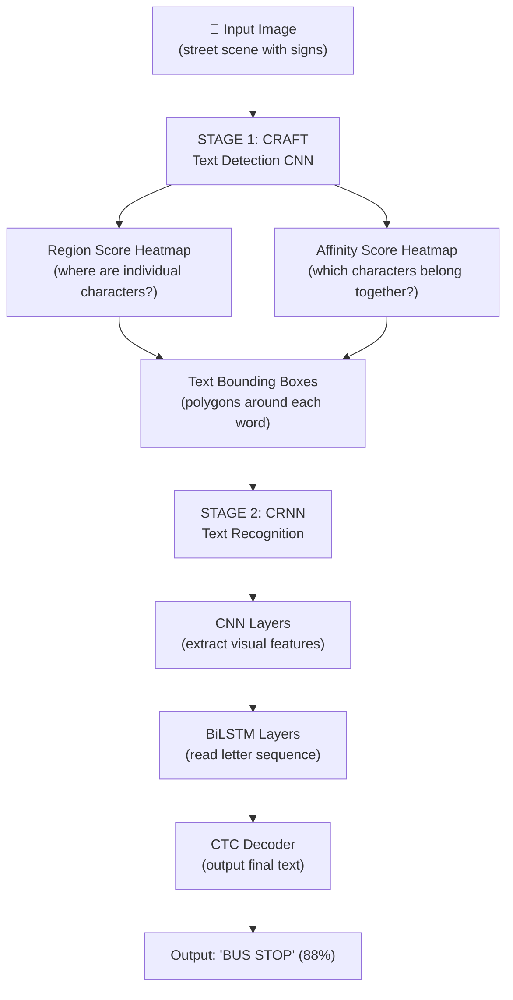
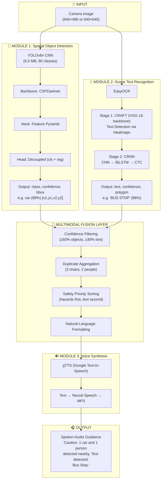

# 🧠 COMPLETE A-TO-Z PROJECT GUIDE
## Multimodal Assistive Vision System for the Visually Impaired

> **Course:** 23CSE473 Neural Networks and Deep Learning
> **Team:** Varsha Vinod, Ajalya T M, Mokshitha Yarlagadda, Kanduri Venkata Sai Mani Avinash
> **Phase:** Phase 1 (50% Implementation Review)

---

# 📋 TABLE OF CONTENTS

1. [The Problem Statement — What & Why](#1-the-problem-statement)
2. [Deep Learning Foundations — Background You MUST Know](#2-deep-learning-foundations)
3. [Literature Review — The 5 Research Papers](#3-literature-review)
4. [Research Gaps — What's Missing in Existing Work](#4-research-gaps)
5. [Our Solution — The Big Picture](#5-our-solution)
6. [Technologies We Use — The Full Stack](#6-technologies-we-use)
7. [Model 1: YOLOv8 — Object Detection (Explained Simply)](#7-model-1-yolov8)
8. [Model 2: EasyOCR — Text Reading (Explained Simply)](#8-model-2-easyocr)
9. [Model 3: gTTS — Voice Output (Explained Simply)](#9-model-3-gtts)
10. [The Complete Architecture — How Everything Connects](#10-the-complete-architecture)
11. [Code Walkthrough — What Happens When You Run It](#11-code-walkthrough)
12. [Dataset & Results](#12-dataset-and-results)
13. [Phase 2 — What's Next](#13-phase-2)
14. [Tough Questions the Professor Will Ask](#14-tough-questions)
15. [Quick Reference Cheat Sheet](#15-cheat-sheet)

---

# 1. THE PROBLEM STATEMENT

## 🌍 The Human Problem (WHY we built this)

Imagine closing your eyes right now and walking from your room to the college canteen. Think about everything you'd bump into — chairs, doors, stairs, parked bikes, moving cars. Now imagine you also can't read the sign that says **"CAUTION: WET FLOOR"** or the room number **"Lab 204"**.

> **2.2 BILLION people worldwide** live with some form of vision impairment. That's almost 1 in 3 humans on Earth.

### What blind people struggle with EVERY DAY:

| Problem | Real-World Example | Why It's Dangerous |
|---------|-------------------|-------------------|
| **Physical Obstacles** | Chairs, tables, open doors, stairs, vehicles | Walking into a car or falling down stairs can cause serious injury |
| **Text Blindness** | Bus route numbers, room signs, medicine labels, caution boards | 80% of navigation cues are written text they can't read |
| **Unfamiliar Environments** | New buildings, hospitals, airports | No mental map = complete dependence on others |

### Why do EXISTING tools fail?

Think of it like this:

| Tool | What It Does | Why It's NOT Enough |
|------|-------------|-------------------|
| 🦯 **White Cane** | Detects objects when the stick physically touches them | Only works at ground level. Can't detect a truck mirror at head height. Can't read ANY text. |
| 📡 **Ultrasonic Smart Cane** | Sends out sound waves, beeps when something is near | A "beep" can't tell you *what* the object is. Is it a harmless curtain or a moving car? |
| 🐕 **Guide Dog** | Leads the person around obstacles | Expensive (\$50,000+), requires years of training, can't read text |
| 📱 **Existing Apps (Be My Eyes)** | Connects to a sighted volunteer via video call | Requires internet, a volunteer's availability, and real-time human help |

### 💡 THE GAP: No single system exists that can:
1. **See** what objects are around you
2. **Read** text on signs and boards
3. **Speak** clear instructions in real-time
4. Run on a **cheap, portable device** (not a \$5000 GPU)

**That's exactly what we built.**

---

# 2. DEEP LEARNING FOUNDATIONS

> [!IMPORTANT]
> You MUST understand these 4 concepts before the presentation. They are the backbone of our entire project.

## 2.1 What is a Neural Network? (The Brain Analogy)

Think of your brain. It has billions of neurons connected by synapses. When you see a cat:
- Some neurons fire for "pointy ears"
- Others fire for "whiskers"
- Others fire for "fur texture"
- Together, they conclude: **"That's a cat!"**

An **Artificial Neural Network (ANN)** works the same way:
- It has layers of artificial "neurons" (just math equations)
- Each neuron takes in numbers, multiplies them by **weights**, adds them up, and passes the result to the next layer
- During **training**, the network adjusts its weights to get better at recognizing patterns

```
Input → [Layer 1] → [Layer 2] → [Layer 3] → Output
         neurons      neurons      neurons
```

**Simple example:**
- Input: pixel values of an image (e.g., 640×640 = 409,600 numbers)
- Output: "This is a **chair**" with 91% confidence

## 2.2 What is a CNN (Convolutional Neural Network)?

A regular neural network treats an image as a **flat list of numbers** — it loses all the spatial information (what's next to what). That's like reading a book by mixing up all the letters!

A **CNN** is smarter. It uses **filters** (small windows) that slide across the image:

```
Image:          Filter (3×3):      What it detects:
🟦🟦🟦🟦🟦      ⬛⬜⬛            Vertical edges!
🟦⬛🟦🟦🟦      ⬛⬜⬛
🟦⬛🟦🟦🟦      ⬛⬜⬛
🟦⬛🟦🟦🟦
🟦🟦🟦🟦🟦
```

### How CNN layers build up understanding:

| Layer Level | What It Detects | Example |
|------------|----------------|---------|
| **Layer 1-3** (Early) | Simple lines, edges, color blobs | "There's a horizontal line here" |
| **Layer 4-6** (Middle) | Shapes, textures, circles, corners | "There's a round shape with a flat surface" |
| **Layer 7+** (Deep) | Complete objects | "That's a **wheel** + **window** + **metal body** = **CAR**" |

> **In our project:** YOLOv8 is a CNN. It uses these layers to detect objects like chairs, cars, and people.

## 2.3 What is an RNN / LSTM (Recurrent Neural Network)?

A CNN is great for images (2D), but **text is sequential** (1D) — the ORDER of letters matters:
- "STOP" ≠ "POTS" ≠ "TOPS"

An **RNN** processes data **one step at a time**, remembering what came before:

```
S → [RNN] → remembers "S"
T → [RNN] → remembers "S, T"
O → [RNN] → remembers "S, T, O"
P → [RNN] → remembers "S, T, O, P" → Output: "STOP"
```

But regular RNNs have a problem: they **forget** things that happened many steps ago (like a goldfish's memory 🐟).

**LSTM (Long Short-Term Memory)** solves this with a "memory cell" that can:
- **Remember** important things for a long time
- **Forget** unimportant things
- **Update** with new information

**BiLSTM** reads BOTH directions:
- Left → Right: S-T-O-P
- Right ← Left: P-O-T-S

This gives much better understanding of the text!

> **In our project:** EasyOCR uses a BiLSTM to read text from signs and boards.

## 2.4 What is Multimodal Deep Learning?

**"Modal" = a type of data**

| Modality | Example | Model Type |
|----------|---------|-----------|
| 🖼️ Visual (Images) | Camera photos of objects | CNN (YOLOv8) |
| 📝 Textual (Text in images) | Signs saying "EXIT", "BUS STOP" | CNN + RNN (EasyOCR) |
| 🔊 Auditory (Speech) | Spoken words through earpiece | TTS (gTTS) |

**Unimodal** = uses only ONE type → e.g., a system that ONLY detects objects but can't read text

**Multimodal** = fuses MULTIPLE types together → **our system does this!**

> **Think of it like the 5 senses:** A human doesn't just see OR just hear — they combine everything. Our system combines seeing objects + reading text + speaking guidance = **multimodal AI assistant**.

---

# 3. LITERATURE REVIEW — The 5 Research Papers

> [!NOTE]
> These are the foundational papers our project builds upon. You need to know what each paper did and why it matters.

## Paper 1: YOLO — "You Only Look Once" (Redmon et al., 2016, IEEE CVPR)

| Aspect | Details |
|--------|---------|
| **What they did** | Invented the YOLO framework — a revolutionary way to detect objects in images by looking at the entire image only ONCE instead of scanning it repeatedly |
| **Before YOLO** | Systems like R-CNN would: (1) propose 2000 possible regions, (2) classify each one separately. Super slow — 47 seconds per image! |
| **YOLO's trick** | Divides the image into a grid, predicts bounding boxes + classes for ALL cells in ONE forward pass |
| **Speed** | 45 FPS (frames per second) — real-time! |
| **Why it matters to us** | YOLOv8 is the 8th generation of this architecture. We use it for obstacle detection. |

## Paper 2: CRAFT — "Character Region Awareness for Text Detection" (Baek et al., 2019, IEEE CVPR)

| Aspect | Details |
|--------|---------|
| **What they did** | Created a deep neural network that finds WHERE text is located in natural images (street signs, storefronts, etc.) |
| **The innovation** | Instead of drawing a single rectangle around text, CRAFT generates TWO heatmaps: (1) **Region Score** — probability each pixel is the center of a character, (2) **Affinity Score** — probability two characters belong to the same word |
| **Why it's special** | Can detect text at ANY angle, on curved surfaces, in neon lights, partially hidden |
| **Why it matters to us** | EasyOCR uses CRAFT as its text detection stage (Stage 1) |

## Paper 3: CRNN — "An End-to-End Trainable Neural Network for Image-based Sequence Recognition" (Shi, Bai & Yao, 2016, IEEE TPAMI)

| Aspect | Details |
|--------|---------|
| **What they did** | Combined CNN + RNN into one network that can READ text from images |
| **Architecture** | CNN (extract visual features) → BiLSTM (understand letter sequences) → CTC Loss (convert to readable text) |
| **CTC Loss explained** | "Connectionist Temporal Classification" — a clever math trick that aligns the neural network's output to actual text WITHOUT needing each character pre-cut |
| **Why it matters to us** | EasyOCR uses CRNN as its text recognition stage (Stage 2) |

## Paper 4: VizWiz — "Answering Visual Questions from Blind People" (Gurari et al., 2018, IEEE CVPR)

| Aspect | Details |
|--------|---------|
| **What they did** | Collected 31,000+ photos taken by ACTUAL blind people asking questions like "What does this medicine label say?" |
| **Key insight** | Real photos from blind users are terrible quality — blurry, finger-in-frame, poorly lit, badly centered |
| **Challenge** | Standard computer vision models trained on clean images FAIL on these messy photos |
| **Why it matters to us** | Shows why we need ROBUST models (YOLOv8 Nano is pre-trained on COCO's diverse scenes). Phase 2 plans to fine-tune on VizWiz data. |

## Paper 5: Assistive AI Systems with Real-Time Object Detection (Various IEEE/MDPI 2024-2025)

| Aspect | Details |
|--------|---------|
| **"YOLOv8-Based XR Smart Glasses"** (MDPI Applied Sciences, 2025) | Deployed YOLOv8n on smart glasses → 88.4% mAP@0.5, 28-32 FPS on edge hardware |
| **"YOLO-OD: Obstacle Detection"** (MDPI Sensors, 2024) | Enhanced YOLOv8 with attention mechanisms → reduced false negatives by 14.2% |
| **"AI-SenseVision"** (IEEE Trans. Human-Machine Systems, 2024) | End-to-end wearable system with depth estimation → latency must stay under 150ms for safe walking |
| **Why they matter** | Validates our approach — single-stage detection + real-time audio feedback is the gold standard |

---

# 4. RESEARCH GAPS — What's Missing in Existing Work

> [!IMPORTANT]
> This is the MOST CRITICAL part. The professor will definitely ask: **"What is your novel contribution?"** The answer lies here.

## The 3 Gaps We Identified:



### GAP 1: Single-Modal Silos 🚧

| What Existing Papers Did | Why It Failed |
|-------------------------|---------------|
| Built systems that do ONLY object detection (e.g., just YOLO) OR ONLY text reading (e.g., just Tesseract) | A blind person walking needs BOTH — they need to avoid the car AND read the bus stop sign. Running two separate apps is impractical. |

**Our Solution:** We combined spatial detection (YOLOv8) + text reading (EasyOCR) + voice output (gTTS) into **ONE unified pipeline** that processes everything simultaneously.

### GAP 2: High Latency / Heavy Compute 🐌

| What Existing Papers Did | Why It Failed |
|-------------------------|---------------|
| Used heavy 2-stage detectors (Faster R-CNN, ResNet-101) requiring expensive desktop GPUs or cloud processing | 2-5 second delay means by the time the system says "car ahead," the user has already been hit! Cloud processing also fails when there's no internet. |

**Our Solution:** YOLOv8 **Nano** is only **6.5 MB** and runs at **15-30 FPS on regular CPUs** — no GPU needed, no internet needed, fits on a phone!

### GAP 3: Raw Outputs vs. Actionable Voice 📢

| What Existing Papers Did | Why It Failed |
|-------------------------|---------------|
| Systems outputted raw bounding box coordinates like "[x:234, y:567, w:89, h:120, class: chair, conf: 0.91]" or dumped ALL detected text | This floods the blind user with meaningless numbers. Saying "chair, chair, chair" five times is confusing. Reading every tiny text fragment is overwhelming. |

**Our Solution:** Our **Fusion Layer** is smart:
- Filters by confidence (≥50% for objects, ≥30% for text)
- Groups duplicates: "3 chairs" instead of "chair, chair, chair"
- **Prioritizes safety**: collision hazards spoken FIRST, text second
- Speaks natural English: *"Caution: 2 chairs and 1 person detected nearby. Text detected: Bus Stop."*

---

# 5. OUR SOLUTION — The Big Picture

## What We Built (in one sentence):

> **An AI system that sees obstacles, reads signs, and speaks guidance — all in real-time on cheap hardware.**

## The System in a Nutshell:

```
📸 Camera captures image
        ↓
   ┌────┴────┐
   ↓         ↓
🎯 YOLOv8   📖 EasyOCR
(sees       (reads
objects)     text)
   ↓         ↓
   └────┬────┘
        ↓
   🧠 Fusion Layer
   (combines, filters,
    prioritizes)
        ↓
   🔊 gTTS
   (speaks to user)
        ↓
   🎧 "Caution: 1 car ahead.
       Text detected: Bus Stop."
```

## The Three Brains:

| Brain | What It Is | What It Does | Like a Human... |
|-------|-----------|-------------|-----------------|
| 🎯 **Spatial Brain** | YOLOv8 CNN | Detects and locates physical objects (car, chair, person) | Eyes recognizing objects |
| 📖 **Reading Brain** | EasyOCR (CRAFT + CRNN) | Reads text from signs, doors, boards | Eyes reading words |
| 🔊 **Voice Brain** | gTTS (Google Text-to-Speech) | Converts information to spoken words | Mouth speaking to the blind person |

---

# 6. TECHNOLOGIES WE USE — The Full Stack

## Software Stack:

| Technology | Version | Purpose | Why This One? |
|-----------|---------|---------|--------------|
| **Python** | 3.x | Programming language | Industry standard for AI/ML |
| **PyTorch** | 2.13.0 (CPU) | Deep learning framework | Powers both YOLOv8 and EasyOCR under the hood |
| **Ultralytics** | 8.4.129 | YOLOv8 library | Official, battle-tested YOLOv8 implementation |
| **EasyOCR** | 1.7.2 | Text recognition | Best scene-text OCR (supports 80+ languages) |
| **OpenCV** | 5.0.0 | Image processing | Industry standard for computer vision |
| **gTTS** | 2.5.4 | Text-to-speech | Free, natural-sounding, multi-language |
| **NumPy** | 2.5.2 | Number crunching | Matrix math for image processing |
| **Pillow (PIL)** | 12.3.0 | Image loading/saving | Simple image I/O |

## Model Files:

| File | Size | Purpose |
|------|------|---------|
| `yolov8n.pt` | 6.5 MB | YOLOv8 Nano weights (used in [main.py](file:///c:/DL_PROJECT/avp/main.py)) |
| `yolov8s.pt` | 22.6 MB | YOLOv8 Small weights (backup) |
| `yolov8m.pt` | 52 MB | YOLOv8 Medium weights (used in [live_cam.py](file:///c:/DL_PROJECT/avp/live_cam.py)) |

## Project Files:

| File | Purpose |
|------|---------|
| [main.py](file:///c:/DL_PROJECT/avp/main.py) | 🏠 Main pipeline — processes test images through all 3 modules |
| [yolo_detection.py](file:///c:/DL_PROJECT/avp/yolo_detection.py) | 🎯 Module 1 — standalone YOLO object detection |
| [ocr_reader.py](file:///c:/DL_PROJECT/avp/ocr_reader.py) | 📖 Module 2 — standalone EasyOCR text reading |
| [live_cam.py](file:///c:/DL_PROJECT/avp/live_cam.py) | 📹 Live webcam demo with real-time speech |
| [train_yolo.py](file:///c:/DL_PROJECT/avp/train_yolo.py) | 🏋️ Fine-tuning YOLOv8 on custom datasets |
| [generate_pptx.py](file:///c:/DL_PROJECT/avp/generate_pptx.py) | 📊 Generates the presentation slides |
| [speak.ps1](file:///c:/DL_PROJECT/avp/speak.ps1) | 🔊 PowerShell script for Windows native TTS in live mode |

---

# 7. MODEL 1: YOLOv8 — Object Detection

## What is YOLO? (Explained Like You're 10)

Imagine you're playing "I Spy" with a friend. Your friend says "I spy 3 things in this room." 

**Old way (Faster R-CNN):** You'd look at EVERY corner of the room one by one, check each spot, and slowly count. Takes forever! ⏰

**YOLO way:** You take ONE quick look at the ENTIRE room and instantly spot everything. That's why it's called **"You Only Look Once"**! ⚡

## YOLOv8 Architecture (Simplified):



### The 3 Parts:

**1. Backbone (CSPDarknet) — "The Eyes"**
- Takes the raw image (640×640 pixels = 409,600 numbers)
- Runs it through convolutional layers
- Extracts features at different scales (small objects, medium objects, large objects)

**2. Neck (Feature Pyramid Network) — "The Bridge"**
- Combines features from different scales
- Small objects (like a cup) need fine details
- Big objects (like a car) need broad context
- The neck fuses both!

**3. Head (Decoupled) — "The Decision Maker"**
- **This is what makes YOLOv8 special!**
- Old YOLO versions used ONE head for both classification AND localization
- YOLOv8 has TWO separate heads:
  - **Classification head**: "This is a *chair*" 
  - **Regression head**: "It's at coordinates [x1, y1, x2, y2]"
- Separating them = much better accuracy!

### Why YOLOv8 NANO specifically?

| Variant | Parameters | Size | Speed (CPU) | Use Case |
|---------|-----------|------|-------------|----------|
| YOLOv8**n** (Nano) ⭐ | 3.2M | 6.5 MB | 15-30 FPS | **Our main model** — fast on CPU |
| YOLOv8**s** (Small) | 11.2M | 22.6 MB | 8-15 FPS | Backup |
| YOLOv8**m** (Medium) | 25.9M | 52 MB | 4-8 FPS | Used in live_cam.py for better accuracy |
| YOLOv8**l** (Large) | 43.7M | 87 MB | 2-4 FPS | Too slow for CPU |
| YOLOv8**x** (XLarge) | 68.2M | 137 MB | 1-2 FPS | Needs GPU |

### Key Technical Terms:

| Term | What It Means | Simple Analogy |
|------|-------------|----------------|
| **Anchor-Free** | Directly predicts object centers and sizes (no pre-defined templates) | Instead of trying on pre-made clothes, the tailor measures you directly |
| **Single-Stage** | Detects everything in one pass (no separate proposal step) | Taking one photo vs taking 2000 photos |
| **COCO Dataset** | The training data — 330,000 images with 80 object classes | Like the textbook YOLOv8 studied from |
| **mAP@0.5** | "mean Average Precision at 50% overlap" — accuracy metric | Like a test score — higher is better |
| **Confidence Score** | How sure the model is (0.0 to 1.0) | "I'm 91% sure that's a car" |
| **Bounding Box** | Rectangle coordinates [x1, y1, x2, y2] around detected object | Drawing a box around something with a marker |

### What Can YOLOv8n Detect? (80 COCO Classes)

**Most relevant for blind users:**
- 🚶 person, 🚗 car, 🚌 bus, 🚚 truck, 🏍️ motorcycle, 🚲 bicycle
- 🪑 chair, 🛋️ couch, 🍽️ dining table, 🚪 door (inferred)
- 🐕 dog, 🐈 cat, 🧳 suitcase, ☂️ umbrella
- 🔥 fire hydrant, 🛑 stop sign, 🚦 traffic light

---

# 8. MODEL 2: EasyOCR — Text Reading

## What is OCR? (Explained Like You're 10)

OCR = **Optical Character Recognition** = Teaching a computer to READ text from pictures.

Imagine taking a photo of a road sign that says "STOP". The computer sees it as just colored pixels. OCR's job is to figure out: "Those pixels spell S-T-O-P!"

## Why Not Just Use Tesseract? (The Old Way)

| | Tesseract (Old) | EasyOCR (Our Choice) |
|--|-----------------|---------------------|
| **Designed for** | Flat, scanned documents (white paper, black text) | Real-world scene text (signs, neon lights, curved surfaces) |
| **Handles tilted text?** | ❌ No | ✅ Yes |
| **Handles curved text?** | ❌ No | ✅ Yes |
| **Handles neon/glowing text?** | ❌ No | ✅ Yes |
| **Handles bad lighting?** | ❌ No | ✅ Yes |
| **Uses Deep Learning?** | Partially (old LSTM) | ✅ Full deep learning (CRAFT + CRNN) |

## EasyOCR's 2-Stage Architecture:



### Stage 1: CRAFT — Finding WHERE Text Is

**CRAFT** = **C**haracter **R**egion **A**wareness for **T**ext Detection

Think of it like a heat-seeking missile for letters:

1. It generates a **Region Score** heatmap — hot spots where individual characters are
2. It generates an **Affinity Score** heatmap — hot spots where characters connect into words
3. By combining these, it draws polygons around each word — even if the text is tilted, curved, or glowing!

**Why polygons, not rectangles?** Because real-world text can be curved (like text on a coffee mug) — a rectangle won't fit it properly!

### Stage 2: CRNN — Reading WHAT the Text Says

**CRNN** = **C**onvolutional **R**ecurrent **N**eural **N**etwork

Once CRAFT finds the text boxes, CRNN reads each one:

1. **CNN part** — Looks at the pixels inside the text box and extracts visual features (the shapes of letters)
2. **BiLSTM part** — Reads the features left-to-right AND right-to-left to understand context
   - Left→Right: seeing "E-X-I-" helps predict "T" comes next
   - Right←Left: seeing "-I-X-E" confirms from the other direction
3. **CTC Decoder** — Converts the neural network's messy output into clean, readable text

### What is CTC Loss? (Simply)

The neural network might output something like: `"EEEE-XX-II-TT"` (it repeats and hesitates). **CTC** (Connectionist Temporal Classification) is a smart math algorithm that collapses this into: `"EXIT"` — removing all the duplicates and blank spaces automatically.

---

# 9. MODEL 3: gTTS — Voice Output

## What is TTS? (Explained Like You're 10)

**TTS** = **T**ext **t**o **S**peech = Teaching a computer to TALK!

You give it text: `"Caution: 1 car ahead"`
It produces audio: 🔊 *"Caution: one car ahead"*

## How gTTS Works:

**gTTS** = **G**oogle **T**ext-to-**S**peech

1. Takes your text string
2. Sends it to Google's neural speech synthesis servers
3. Returns an MP3 audio file of a natural-sounding human voice
4. We save this file and play it to the user

## The Smart Part: Our Fusion Layer

> [!TIP]
> The Fusion Layer is our **NOVEL CONTRIBUTION** — this is what makes our system different from just running YOLOv8 and EasyOCR separately.

### The Problem of Audio Clutter:

If a camera sees 15 objects and 30 text fragments, dumping ALL of that into audio would sound like:
> *"person person person chair chair chair table bottle cup car car car car text Exit text Open text Hours text Monday text to text Friday..."*

That's USELESS for a blind person. They'd be confused and overwhelmed.

### Our Solution — Smart Fusion Algorithm:

```
Step 1: CONFIDENCE FILTERING
├── Objects: Keep only if confidence ≥ 50%
└── Text: Keep only if confidence ≥ 30%

Step 2: QUANTITY AGGREGATION
├── "chair, chair, chair" → "3 chairs"
└── "person, person" → "2 people"

Step 3: SAFETY PRIORITY SORTING
├── FIRST: Collision hazards (cars, people, obstacles)
└── THEN: Informational text (signs, labels)

Step 4: NATURAL LANGUAGE FORMATTING
├── "Caution: 2 chairs and 1 person detected nearby."
└── "Text detected: Bus Stop."

Step 5: SPEECH GENERATION
└── gTTS converts → MP3 audio → plays through earpiece
```

### In Live Mode ([live_cam.py](file:///c:/DL_PROJECT/avp/live_cam.py)):

The system also adds **spatial descriptions**:
- **Direction**: "on your left" / "on your right" / "ahead of you" (based on where in the frame the object is)
- **Proximity**: "very close" / "nearby" / "ahead" (based on how big the bounding box is — bigger = closer)

Example: *"Caution! A person is very close on your left. 2 chairs are nearby ahead of you. Text visible: EXIT."*

---

# 10. THE COMPLETE ARCHITECTURE

## System Architecture Diagram:



---

# 11. CODE WALKTHROUGH — What Happens When You Run It

## Running `python main.py`:

Here's EXACTLY what happens, step by step:

### Step 0: Load Models (happens once at startup)

```python
# From main.py lines ~165-170
yolo_model = load_yolo_model()    # Loads yolov8n.pt (~0.2 seconds)
ocr_reader = load_ocr_model()     # Loads EasyOCR English (~1.5 seconds)
```

### Step 1: For each test image...

```
📁 test_images/
├── street_crosswalk_01.jpg
├── indoor_stairs_02.jpg
├── sign_cafe_04.jpg
├── mixed_bus_stop_03.jpg
└── ... (38 images total)
```

### Step 2: YOLOv8 Object Detection

```python
# From main.py → detect_obstacles()
results = model(image_path, verbose=False)  # ONE forward pass through CNN
# Result example:
# [
#   {"class_name": "person", "confidence": 0.91, "bbox": [120, 80, 340, 450]},
#   {"class_name": "car",    "confidence": 0.88, "bbox": [400, 200, 620, 380]},
#   {"class_name": "bench",  "confidence": 0.76, "bbox": [50, 300, 200, 400]}
# ]
```

### Step 3: EasyOCR Text Recognition

```python
# From main.py → read_text()
results = reader.readtext(image_path)  # CRAFT + CRNN pipeline
# Result example:
# [
#   {"text": "Bus Stop",  "confidence": 0.88, "bbox": [[10,20],[200,20],[200,60],[10,60]]},
#   {"text": "Line 42",   "confidence": 0.72, "bbox": [[10,70],[150,70],[150,100],[10,100]]}
# ]
```

### Step 4: Fusion — Combine into Speech

```python
# From main.py → format_obstacle_warning() + format_text_announcement()
obstacle_msg = "Caution: 1 car and 1 person detected nearby."
text_msg = "Text detected nearby: Bus Stop, Line 42."
final_message = f"{obstacle_msg} {text_msg}"
# → "Caution: 1 car and 1 person detected nearby. Text detected nearby: Bus Stop, Line 42."
```

### Step 5: Save Outputs

```python
# Save annotated image (YOLO pink boxes + OCR green polygons)
draw_combined_output(...)  # → output/combined_mixed_bus_stop_03.jpg

# Save audio file
speak_output(final_message, audio_path)  # → output/audio_mixed_bus_stop_03.mp3
```

## Running `python live_cam.py` (Real-Time Demo):

| What Happens | Interval | Details |
|-------------|----------|---------|
| Webcam captures frame | Every frame (~30 FPS) | `cap.read()` |
| YOLOv8 detects objects | Every frame | Runs inference with 35% confidence threshold |
| EasyOCR reads text | Every 2 seconds | Slower, so runs less frequently to maintain video FPS |
| Speech output | Every 4 seconds | Speaks the current scene description through Windows TTS |
| Display | Continuous | Shows annotated video with boxes and text overlays |

### Spatial Description in Live Mode:

The live camera adds position info based on WHERE in the frame objects appear:

```python
# From live_cam.py → describe_position()
# If object center is in the left 1/3 of frame → "on your left"
# If in the right 1/3 → "on your right"
# If in the center 1/3 → "ahead of you"

# If bounding box area > 15% of frame → "very close"
# If > 5% → "nearby"
# Otherwise → "ahead"
```

---

# 12. DATASET AND RESULTS

## Test Dataset: 38 Images in 4 Categories

| Category | Images | What They Test |
|----------|--------|---------------|
| 🚗 **Street Scenes** (`street_*.jpg`) | 8 | Crosswalks, traffic, pedestrians, bicycles, cars |
| 🏠 **Indoor Scenes** (`indoor_*.jpg`) | 5 | Rooms, stairs, hallways, doors, kitchen |
| 🪧 **Signs & Text** (`sign_*.jpg`, `ocr_test_*.jpg`) | 12 | Storefronts, neon signs, road signs, menus |
| 🌧️ **Mixed/Challenging** (`mixed_*.jpg`) | 5 | Night scenes, rain, crowded markets, bus stops |
| 📝 **Real-world text** (`text_*.jpg`, `real_*.jpg`) | 8 | Books, exit signs, stop signs, street names |

## Outputs Generated: 42+ Files

| Output Type | Count | Example |
|-------------|-------|---------|
| 🖼️ YOLO annotated images | 21 | `yolo_street_crosswalk_01.jpg` |
| 🖼️ OCR annotated images | 11 | `ocr_sign_cafe_04.jpg` |
| 🖼️ Combined annotated images | 3 | `combined_mixed_bus_stop_03.jpg` |
| 🔊 Audio guidance files | 3 | `audio_mixed_bus_stop_03.mp3` |

## Training Run (Smoke Test):

From [runs/detect/runs/train/smoke_real_coco/results.csv](file:///c:/DL_PROJECT/avp/runs/detect/runs/train/smoke_real_coco/results.csv):

| Metric | Value | What It Means |
|--------|-------|--------------|
| **mAP@50** | 0.605 (60.5%) | At 50% overlap threshold, model correctly detects 60.5% of objects |
| **mAP@50-95** | 0.444 (44.4%) | Averaged across multiple overlap thresholds |
| **Precision** | 0.633 (63.3%) | Of all detections made, 63.3% were correct |
| **Recall** | 0.633 (63.3%) | Of all actual objects, 63.3% were found |

> [!NOTE]
> This was a **1-epoch smoke test** on COCO8 (tiny dataset) — just to verify the training pipeline works. Real fine-tuning in Phase 2 will use many more epochs on assistive-specific data.

---

# 13. PHASE 2 — What's Coming Next

| Feature | Technology | Why |
|---------|-----------|-----|
| 🎯 **Fine-tune YOLOv8 on VizWiz** | Transfer learning on real blind-user photos | Current COCO model doesn't know "pothole", "curb", "staircase railing" |
| 🖼️ **Vision-Language Model (VLM)** | BLIP-2 or similar | Generate full scene descriptions: "You are standing in front of a cafeteria with an empty table on your left" |
| 📏 **Depth Estimation** | MiDaS monocular depth | Calculate actual distance: "Chair 1.5 meters ahead" instead of just "chair nearby" |
| 📱 **Edge Deployment** | Raspberry Pi 4 / Jetson Nano / Android | Make it truly portable — a blind person can carry it |

---

# 14. TOUGH QUESTIONS THE PROFESSOR WILL ASK

## Q1: "Why YOLOv8 and not Faster R-CNN or SSD?"

> **Answer:** *"Faster R-CNN is a two-stage detector — it first generates 2000 region proposals, then classifies each one. This takes 2-3 seconds per frame on CPU, which is too slow for real-time walking assistance. SSD is single-stage but uses older anchor-based methods with lower accuracy. YOLOv8 Nano is anchor-free, single-stage, with a decoupled head that separates classification from localization. It's only 6.5 MB and runs at 15-30 FPS on CPU — perfect for our use case."*

## Q2: "Why EasyOCR instead of Tesseract?"

> **Answer:** *"Tesseract was designed for scanning flat documents — black text on white paper. It fails on scene text like tilted street signs, curved neon letters, or text with bad lighting. EasyOCR uses CRAFT for text detection (generates heatmaps for character regions and affinity) and CRNN with BiLSTM and CTC Loss for recognition. This handles arbitrary angles, curves, and lighting conditions."*

## Q3: "What is your NOVEL contribution?"

> **Answer:** *"Our novel contribution is threefold: (1) We designed a unified multimodal architecture that integrates spatial CNN detection with CRNN scene text extraction in a single pipeline — most papers do only one. (2) We created an intelligent fusion algorithm that filters by confidence, aggregates duplicates, and prioritizes collision hazards. (3) We implemented end-to-end voice guidance that produces natural English sentences — not raw coordinates."*

## Q4: "How do you handle distance estimation?"

> **Answer:** *"In Phase 1, we estimate proximity using bounding box area ratios — a large bounding box means the object is close. In our live camera system, if a bounding box occupies more than 15% of the frame, we classify it as 'very close.' In Phase 2, we plan to integrate MiDaS monocular depth estimation to calculate exact metric distances like '1.5 meters ahead.'"*

## Q5: "How do you prevent audio overload?"

> **Answer:** *"Four mechanisms: (1) Confidence thresholding — objects below 50% and text below 30% are filtered out. (2) Duplicate aggregation — '2 chairs' instead of 'chair, chair.' (3) Priority ordering — collision hazards are spoken first, text second. (4) Text capping — we limit to the top 5 most prominent text fragments."*

## Q6: "Why is the OCR confidence threshold (30%) lower than YOLO's (50%)?"

> **Answer:** *"Scene text recognition is inherently harder than object detection because text can be partially occluded, stylized, or low-contrast. A 30% threshold allows us to catch text that's still readable by humans but harder for the model. We prefer a lower threshold for text because missing a sign that says 'DANGER' is more harmful than occasionally reading a false text fragment."*

## Q7: "What about privacy concerns with the camera?"

> **Answer:** *"All processing happens locally on the device — no images are sent to any cloud server. The only external call is gTTS for speech synthesis in the batch demo. In the live camera mode, we use Windows native System.Speech which is completely offline. In Phase 2, we plan to use fully offline TTS as well."*

## Q8: "What is CTC Loss and why do you need it?"

> **Answer:** *"CTC stands for Connectionist Temporal Classification. When the CRNN reads text, it doesn't output one letter at a time — it outputs a probability distribution for each time step. The raw output might look like 'SSSS-TT-OO-PPP' for the word 'STOP.' CTC is a decoding algorithm that collapses repeated characters and removes blanks to produce the clean text. It's essential because it eliminates the need to manually segment each character."*

---

# 15. QUICK REFERENCE CHEAT SHEET

## One-Liner Definitions:

| Term | Definition |
|------|-----------|
| **CNN** | Neural network that uses sliding filters to detect patterns in images |
| **RNN** | Neural network that processes sequences one step at a time, remembering past steps |
| **LSTM** | An improved RNN with memory gates that can remember long-term information |
| **BiLSTM** | LSTM that reads both forwards and backwards for better understanding |
| **YOLO** | "You Only Look Once" — detects all objects in one pass |
| **Anchor-Free** | Predicts object locations directly without pre-defined template shapes |
| **Decoupled Head** | Separates "what is it?" from "where is it?" for better accuracy |
| **CRAFT** | Detects text locations using character-region and affinity heatmaps |
| **CRNN** | CNN + RNN combined to both see and read text |
| **CTC** | Algorithm that converts messy neural outputs into clean text |
| **gTTS** | Google's text-to-speech that converts text to natural audio |
| **COCO** | Microsoft's dataset of 330K images with 80 object classes |
| **mAP** | Mean Average Precision — THE accuracy metric for object detection |
| **Multimodal** | System that processes multiple types of data (vision + text + audio) |
| **Fusion Layer** | Our smart algorithm that combines and prioritizes all detections |
| **Inference** | Running the trained model on new data (not training) |
| **Fine-tuning** | Taking a pre-trained model and training it more on specialized data |
| **Transfer Learning** | Reusing knowledge from one task for another (COCO → assistive objects) |

## How to Run the Project:

```bash
# Process all test images
python main.py

# Process a single image
python main.py --image test_images/street_crosswalk_01.jpg

# Run YOLO detection only
python yolo_detection.py

# Run OCR only
python ocr_reader.py

# Live webcam demo (needs webcam!)
python live_cam.py

# Train/fine-tune YOLO (smoke test)
python train_yolo.py --data coco8.yaml --epochs 3
```

---

> [!CAUTION]
> **REMEMBER FOR THE PRESENTATION:**
> - Every team member must speak
> - Show REAL outputs from YOUR code — not copied from papers
> - The architecture block diagram is the MOST IMPORTANT slide
> - Keep slides clean: 6 bullets max, 6 words per bullet
> - Have a backup of everything on multiple devices
> - Practice within 10-15 minutes!

---

*This guide was generated from a thorough analysis of every file in the project. Good luck with the presentation! 💪*
