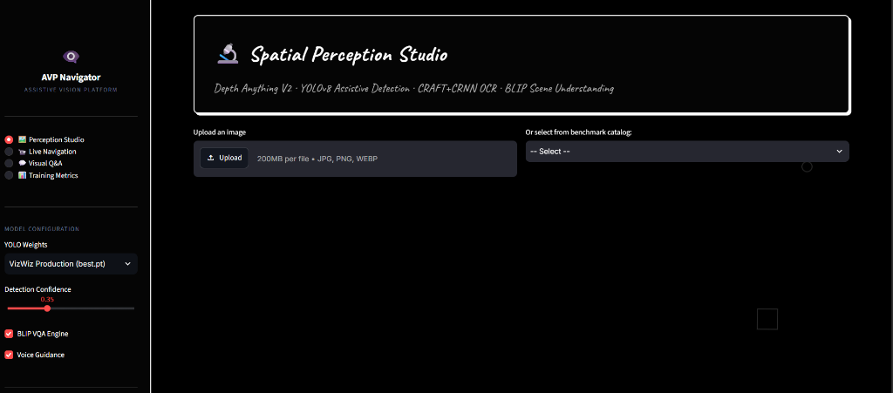
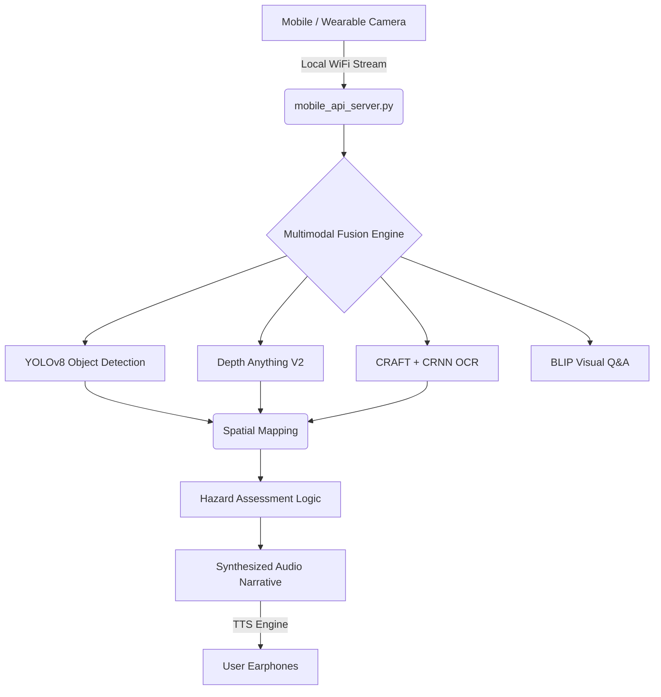

# Assistive Vision Platform (AVP)

An advanced, multimodal edge-AI system designed to provide real-time navigation assistance and scene understanding for visually impaired individuals. AVP processes live video feeds entirely on local hardware, ensuring privacy and zero-latency dependence on cloud APIs.


*(Dashboard featuring custom high-contrast accessibility themes and real-time inference metrics).*

## System Architecture



## Core AI Modules

### 1. Spatial Object Detection (`yolo_detection.py`)
Utilizes a custom fine-tuned YOLOv8 model to identify everyday obstacles (doors, chairs, vehicles, stairs). It is heavily optimized for CPU/Edge inference to maintain high frame rates.

### 2. Monocular Depth Estimation (`depth_estimator.py`)
Integrates **Depth Anything V2** to calculate relative proximity. It maps 2D bounding boxes to 3D space, filtering out distant objects and explicitly flagging `CRITICAL` objects within 1-2 meters.

### 3. Scene Text Recognition (`ocr_reader.py`)
- **CRAFT** (Character Region Awareness for Text Detection) isolates text regions.
- **CRNN** reads the text, allowing the system to dictate signage, warnings, and room numbers.

### 4. Visual Question Answering (`vlm_context.py`)
Employs the **BLIP** Vision-Language Model. This allows the user to ask specific context-aware questions about the scene (e.g., "What color is the door?", "Is there a crosswalk?").

### 5. Multimodal Fusion (`multimodal_fusion_v2.py`)
The central conductor. It merges bounding boxes with depth maps and OCR data to generate a coherent, safe navigation prompt without overwhelming the user with audio spam.

## Mobile Pocket Camera Integration

To solve the hardware constraint of carrying a heavy laptop, AVP includes a secure mobile bridge:
- `mobile_api_server.py` hosts a local HTTPS server.
- `mobile_nav.html` runs in the user's smartphone browser (kept in a chest pocket with the rear camera facing outward).
- It captures frames, sends them to the laptop for heavy AI processing, and receives the text narrative back.
- The smartphone utilizes the native **Web Speech API** to dictate the surroundings through connected earphones, smartly interrupting long sentences instantly if a `CRITICAL` hazard appears.

## Setup & Installation

**1. Clone and Install Dependencies:**
```bash
git clone https://github.com/Kanduriavinash/Assistive-vision-model.git
cd Assistive-vision-model
pip install -r requirements.txt
```

**2. Model Weights:**
Ensure the `yolov8n.pt`, `yolov8s.pt`, or `yolov8m.pt` weights are present in the root directory.

**3. Run the Evaluation Dashboard:**
```bash
streamlit run app_gui.py
# or use the provided run_phase2.bat script
```

**4. Run the Mobile Navigation Server:**
```bash
python mobile_api_server.py
```
*(On your phone, navigate to `https://<YOUR_LAPTOP_IP>:8502`. Accept the self-signed certificate, grant camera permissions, and begin navigation).*

## Documentation
For detailed research guidelines, training metrics, academic abstracts, and Jupyter Notebooks, please refer to the files inside the `Project_Documentation/` folder.
