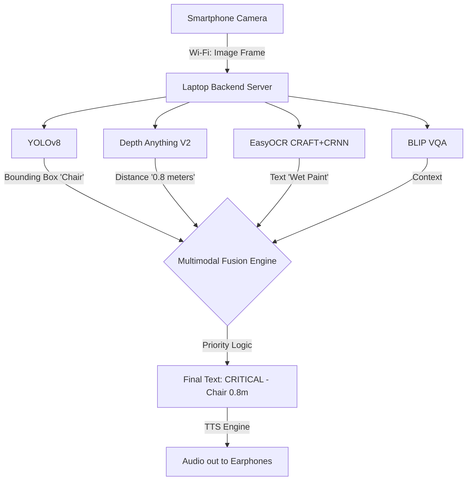

# STEP 2: END-TO-END PIPELINE & ELI5 MODEL EXPLANATIONS

This document explains the entire flow of your project from the moment the camera sees something, to the moment the blind user hears a warning. 

## 1. How the Input is Taken
*   **The Hardware:** The user has their smartphone in their chest pocket, rear camera facing forward.
*   **The Code:** `mobile_nav.html` uses JavaScript (`navigator.mediaDevices.getUserMedia`) to turn on the phone's camera.
*   **The Transfer:** The phone takes a picture (a 2D image frame) a few times every second and sends it silently over the local Wi-Fi to your laptop (`mobile_api_server.py`) using an HTTP POST request.
*   **Why?** Because a phone isn't powerful enough to run 6 deep learning models. The laptop does the heavy lifting, acting as the "brain" in the user's backpack.

---

## 2. The 6 Models (Explained for a 1st Grader)

If a professor asks you to explain the models simply, use these analogies!

### Model 1: YOLOv8 Nano (The "Highlighter")
*   **1st Grader Explanation:** Imagine you have a coloring book. YOLO is like a magic highlighter that instantly draws a perfect square around every dog, cat, or chair on the page, and yells out its name.
*   **Technical Explanation:** It is a single-stage Convolutional Neural Network (CNN). It looks at the whole image in one pass, extracts features, and outputs bounding boxes (X, Y coordinates) and class labels with a confidence score.
*   **Example:** It sees a shape and outputs: `[Box: 100, 50, 200, 300], Label: "Chair", Confidence: 85%`.

### Model 4: Depth Anything V2 (The "Magic Ruler")
*   **1st Grader Explanation:** When you look at a picture of a car, how do you know if it's a real car that is far away, or a tiny toy car right in front of you? Your brain just *knows*. Depth Anything V2 is a magic ruler that guesses how far away things are just by looking at a flat picture!
*   **Technical Explanation:** It is a Vision Transformer (ViT) that does *monocular depth estimation*. It analyzes lighting, shadows, and object scale to create a grayscale "Depth Map" where bright pixels mean the object is physically close to the camera, and dark pixels mean it is far away.

### Models 2 & 3: CRAFT & CRNN (The "Reader")
*   **1st Grader Explanation:** Imagine looking at a messy bulletin board. First, you use a red pen to draw a circle around everywhere you see a word (That's **CRAFT**). Then, you read the letters inside those circles out loud (That's **CRNN**).
*   **Technical Explanation:** 
    *   **CRAFT (Text Detection):** Generates heatmaps to find the physical regions of the image that contain characters.
    *   **CRNN (Text Recognition):** Uses a Bidirectional LSTM to read the cropped text images and translate them into a computer string.

### Model 5: BLIP (The "Detective")
*   **1st Grader Explanation:** If YOLO just says "Door", BLIP is the smart detective who can answer questions like, "Is the door open or closed?" or "What color is the door?"
*   **Technical Explanation:** A Vision-Language Transformer (VLM). It encodes the image into features, reads the user's text prompt, and generates a contextual text answer. 

### Model 6: Neural TTS (The "Voice")
*   **1st Grader Explanation:** A robot that reads words on a screen out loud.
*   **Technical Explanation:** Converts text strings into acoustic audio waves sent to the user's earphones.

---

## 3. The Fusion Engine (The "Traffic Cop")
If the camera sees a chair, a poster, and a car all at once, and all the models yell their answers at the exact same time, the blind user would get confused by the noise. 

Your **Multimodal Fusion Layer** (`multimodal_fusion_v2.py`) is the Traffic Cop. 
*   It takes the boxes from YOLO and overlays them on the Depth Map to find out *exactly how far away the object is*.
*   If an object is closer than 1.5 meters, it tags it as **CRITICAL**.
*   It blocks useless information (like reading a sign 10 meters away) if there is a CRITICAL object (like a bicycle 1 meter away).

---

## 4. Worked Example: Tracing a Frame

Let's trace exactly what happens in your code if the blind user walks toward a **Chair** that has a **"WET PAINT"** sign on it.

1.  **Input:** Phone sends the frame to `mobile_api_server.py`.
2.  **YOLO (Model 1):** Detects the chair. Outputs `[Chair, Confidence 90%]`.
3.  **Depth (Model 4):** Calculates that the pixels inside the Chair's bounding box are very bright (close). It estimates the distance is **0.8 meters**.
4.  **OCR (Models 2 & 3):** CRAFT finds text. CRNN reads it as `"WET PAINT"`.
5.  **Fusion Logic:** 
    *   Fusion engine sees the Chair is < 1.5m. It upgrades it to a `CRITICAL HAZARD`.
    *   It sees the OCR text.
    *   It combines them into a single, clean sentence: `"CRITICAL PROXIMITY: Chair directly ahead. Text detected: WET PAINT."`
6.  **Output (Model 6):** The string is sent back to the phone, which uses Web Speech API to instantly speak it into the user's AirPods.

---

## 5. System Flow Diagram

